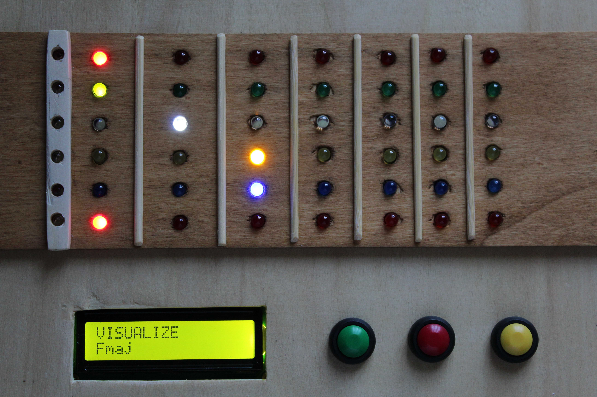
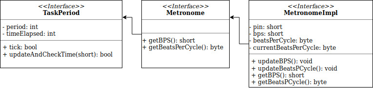

# 	AGT - Arduino Guitar Trainer

Progetto per il corso di Laboratorio di Making, anno 2017/2018.

Studente: **Ceccolini Enrico**  800490





### Obiettivo

Realizzare un metronomo per chitarra che offra anche un elemento visivo a supporto dell'esecuzione dei classici esercizi di riscaldamento, di sviluppo dell'orecchio ritmico e della tecnica ritmica. Questo elemento sarà in grado di mostrare, al chitarrista principiante, la diteggiatura per la mano sinistra (accordi, scale e singole note) aiutandolo nell'approccio al metronomo, consigliando esercizi e guidandone l'esecuzione.


## 1. Analisi

Un metronomo è uno strumento che aiuta (o forse obbliga) il musicista ad andare a tempo durante l'esecuzione degli esercizi, eliminando la tendenza di accelerare o rallentare. Risulta chiaro, che il controllo preciso del tempo, è una caratteristica essenziale per questo progetto.

Le funzionalità che l'AGT vuole aggiungere ad un classico metronomo, derivano dall'affiancamento di un finto manico di chitarra in grado di fornire una rappresentazione visiva degli esercizi. Il manico possiederà una matrice led S x F , dove S corrisponde al numero di corde (strings) e F al numero di tasti (frets), questa sarà disposta sopra il finto manico di chitarra, per poter indicare i tasti che la mano deve premere per suonare singole note o accordi.

Le funzionalità aggiuntive sono:

- visualizzazione di accordi
- visualizzazione di giri armonici, accordo per accordo
- play dei giri armonici secondo le impostazioni del metronomo
- visualizzazione di scale musicali
- play delle scale musicali secondo le impostazioni del metronomo


### 1.1. Vincoli progettuali

#### 1.1.1. Dimensioni

S'intende realizzare un finto manico di chitarra in legno che, per quanto possibile, rispetti le dimensioni di uno vero. Lo strumento presenterà dunque una forma allungata, tenendo in considerazione la possibilità di scalabilità (aumentare il numero di tasti per corda).

#### 1.1.2. Componenti elettronici

Il progetto prevede l'utilizzo di una scheda ArduinoUno. L'intera logica di funzionamento sarà a suo carico, la scheda conterrà inoltre le informazioni necessarie al funzionamento come: accordi, giri armonici e scale.

Tra i vincoli troviamo:

- **Controllo preciso del tempo:** 
  Trattandosi di un modello a loop, la reattività del sistema dipende da quanto rapidamente viene completato un ciclo del main loop. Dovendo realizzare un metronomo, il controllo preciso del tempo diviene una caratteristica essenziale (sincronismo tra audio e elementi visivi compreso). È richiesto un utilizzo consapevole degli Arduino Timer Interrupts e un main loop di dimensioni limitate, che non preveda l'utilizzo di operazioni bloccanti e attese.
- **Numero limitato di pin programmabili e alto numero di componenti:** 
  La scheda Arduino possiede 14 pin digitali e 6 pin analogici. Solo 6 dei pin digitali possono emulare un segnale analogico in uscita. Il progetto prevede l'utilizzo di un alto quantitativo di led, il numero minimo di tasti necessari per poter rappresentare almeno una posizione degli accordi facenti parte dei giri armonici di DO, RE, MI, FA, SOL, LA, SI è 7 , al quale si deve aggiungere il capotasto per un totale di 6 * (7+1)  = 48 led. L'utilizzo di shift register risulta obbligato. Uno shift register a 8 bit può controllare 8 led utilizzando soli 3 pin di Arduino.
- **Memoria:**
  L'arduinoUno possiede uno spazio di memoria dedicato al codice compilato tuttavia, la presenza diretta nel codice di stringhe di testo utili per descrivere i vari esercizi al principiante, ha un impatto rilevante sull'occupazione della memoria dinamica da parte delle variabili globali. Per questo progetto si è deciso di non utilizzare una memoria aggiuntiva (come può essere una scheda SD), limitando le stringhe di testo.


### 1.2. Gli esericizi

Gli esercizi provengono da diverse fonti. 

- **Giri armonici:** esercizi provenienti da: "Esercizi a giro armonico in tutti i toni" presente in un libro scolastico[1]. Impostando i bps e il numero di movimenti per battuta, suonare l'accordo ad ogni battito, passando al prossimo quando occorre il primo moviemento (suono distinto dal metronomo).
- **Riscaldamento:**  esercizi provenienti da un blog musicale[2]. Vengono definite una serie di scale le cui note sono posizionate nei primi quattro tasti della chitarra. Impostando i bps, suonare una nota della scala ad ogni battito.
  - partendo dal I tasto: 1 2 4 3, 1 3 2 4, 1 3 4 2, 1 4 2 3, 1 4 3 2
  - partendo dal II tasto: 1 3 2 4, 1 3 2 4, 1 3 2 4, 1 3 2 4, 1 3 2 4
  - partendo dal III tasto: 1 4 2 3, 1 4 2 3, 1 4 2 3, 1 4 2 3, 1 4 2 3
- **Scale:** esercizi provenienti da un blog musicale[3]. Vengono definite una serie di scale, selezionando tonalità e bps, suonare una nota della scala ad ogni battito.
  - scala maggiore
  - scala naturale minore
  - pentatonica minore


## 2. Sviluppo HW

### 2.1. Componenti	e materiale

Per la realizzazione dell' AGT sono stati utilizzati:

- 6 shift regiter 74HC595
- 48 LED di 5 colori diversi (rosso, verde, bianco, blu, giallo)
- 48 resistenze (una per LED) + 3 resistenze per i pulsanti
- 3 tasti (verde, rosso e giallo)
- uno schermo LCD + una interfaccia I2C
- un cicalino
- un potenziometro 
- 2 schede millefori 18x10 cm
- una tavola di legno sottile per la scatola


### 2.2. Circuito

#### 2.2.1. Prototipo su breadboard

Si è deciso che ogni shift register controlli una corda, in questo modo è possibile realizzare un circuito base, che poi potrà essere replicato per ottenere le corde successive.


Grazie allo shift register sarà possibile pilotare singolarmente ognuno degli 8 led, utilizzando solamente 3 pin di arduino (2 pwm e uno no). Gli integrati 74HC595 prevedono poi una caratteristica decisamente utile cioè quella di poter essere collegati in cascata in modo da simulare dei registri a 16, 24, 32, ... bit. Nel passaggio allo schema su basetta millefori, verranno disposti in fila indiana per semplificare il collegamento in serie e permettere di controllare tutti i led di tutte le "corde" con solo 3 pin dell'Arduino (si veda appendice A).


#### 2.2.2. Circuito su basetta millefori

Dovendo realizzare una figura simmetrica con dei componenti elettronici, si è optato per utilizzare la precisione fornita dalle schede millefori disponendo in primo luogo i led. Dato l'elevato numero di collegamenti (solo per i led 48 + le messe a terra), ho deciso di utilizzare, per quest'ultimi, sia il fronte che il retro della millefori. I collegamenti sul retro saranno realizzati tramite piste saldate, mentre sul fronte da cavetti.

Per predisporre il tutto ho disegnato gli schemi PCB con il software Fritzing, replicando le giuste dimensioni (compreso lo spazio tra un foro e l'altro) della millefori.


I 6 shift register hanno trovato spazio nel lato lungo di una delle due basette millefori. Grazie a questa disposizione, 7 degli 8 piedini di output di ogni integrato sono rivolti alla corrispettiva fila di led, mentre tutti i piedini utili per i collegamenti in cascata (clock e dati) rimangono sullo stesso lato rivolto all'esterno.

La distanza tra due file di led è imposta dal passaggio di 3 piste saldate sul retro, che servono a collegare i primi 3 led di ogni fila. I restanti 5 led sono raggiunti da collegamenti posti sul fronte.


Per comporre la prima fila verticale ho utilizzato dei led bianchi, questa rappresenterà il capotasto (il dover suonare la corda a vuoto).

Elenco dei componenti utilizzati per corda (partendo dalla fila in alto nella precedente immagine):

- **prima corda:** 7 led rossi con resistenza 1 kΩ + 1 led bianco con resistenza 11 kΩ
- **seconda corda:** 7 led verdi con resistenza 330 kΩ + 1 led bianco con resistenza 11 kΩ
- **terza corda:** 7 led bianchi con resistenza 4.7 kΩ + 1 led bianco con resistenza 11 kΩ
- **quarta corda:** 7 led gialli con resistenza 330 kΩ + 1 led bianco con resistenza 11 kΩ
- **quinta corda: **7 led blu con resistenza 4.7 kΩ + 1 led bianco con resistenza 11 kΩ
- **sesta corda: **7 led rossi con resistenza 1kΩ + 1 led bianco con resistenza 11 kΩ


#### 2.3. Costruzione della scocca


## 3. Sviluppo SW

### 3.1. Logica del sistema


#### 3.1.1. Macchina a stati

Si è deciso di modellare il comportamento tramite una macchina a stati finiti sincrona, in modo da avere un tempo discreto e permettere un suo controllo preciso. Ad ogni tick si controlla l'eventuale pressione di un tasto, utile per la navigazione tra stati fino ad arrivare al PLAY dove il sistema eseguirà l'esercizio selezionato facendo partire i task dedicati, che risulteranno sincroni.


- **START:** 
  Stato di benvenuto.

- **SELECT ES:** 
  Questo stato è dedicato alla selezione dell'esercizio che si intende eseguire tra:

  - visualizza e suona **accordo**
  - visualizza e suona **giro** di accordi
  - visualizza e suona **scala**
  - visualizza e suona riscaldamento

  La selezione caratterizza il soggetto degli stati futuri, che sarà: *accordo* o *giro* o *scala*.

- **SELECT TONE:**
  Questo stato è dedicato alla selezionde della tonalità della precedente selezione.

  - A, B, C, D, E, F, G.

- **SELECT TYPE:**
  Questo stato è dedicato alla tipologia della precedente selezione.

  - Accordo: maggiore, minore, di settima, ecc...
  - Giro: maggiore
  - Scala: maggiore, minore naturale, pentatonica minore

- **VISUALIZE:**

  Questo stato è dedicato alla visualizzazione dell'esercizio. 

  - Accordo: visualizzare l'accordo
  - Giro: visualizzare singolarmente gli accordi che fanno parte di esso
  - Scala: visualizzare le note che fanno parte di essa

- **METRONOME:**
  Questo stato è dedicato alla selezione dei BPS e del numero di battiti per ciclo.

  - BPS: 20, 40, 60, 80, 100, 120, 140, 160, 180, 200, 220
  - Battiti per ciclo: 1, 2, 3, 4, 5, 6, 7, 8

- **PLAY:**
  Questo stato è dedicato all'esecuzione dell'esercizio. I task necessari all'esecuzione vengono avviati e proseguiranno fino all'interruzione da parte dell'utente.


#### 3.1.2. Implementazioni macchina a stati

La macchina a stati sincrona, è stata implementata seguendo la tecnica utilizzata dai compilatori di linguaggi sincroni. Ad ogni tick del timer viene chiamata una funzione step che, grazie all'utilizzo del costrutto *switch* , indirizza l'esecuzione a seconda dello stato in cui ci si trova. Il vantaggio risulta essere che il tempo è scandito da un unico clock interno alla macchina a stati, rendendo non necessari altri cicli oltre al main loop per eseguire delle operazioni come il play di esercizi.

``` c++
/** arduino-guitar-trainer.ino */

#include "Timer.h"
#define BASE_PERIOD 50  // clock tick period
Timer timer;

void setup() {
    ...
    timer.setupPeriod(BASE_PERIOD);  //timer's period is set to 50ms
}

void loop() {
    /* wait for timer signal */
    timer.waitForNextTick();
    step();
}

void step() {
	switch (state) {
        case START:
              ...
        break;     
        ....
        case PLAY:
            switch (esState) {
                case CHORDS:
                    ...
                break;
                ...
             break;
        break;
    }
}
```


La gestione del tempo è stata implementata basandosi sull'utilizzo dell'interruzione di timer programmabili presenti su Arduino.

```c++
void Timer::setupPeriod(int period){
	...
    /* 
     * set compare match register
     * OCR1A = (16*2^20) / (100*PRESCALER) - 1 (must be < 65536)
     * assuming a prescaler = 1024 => OCR1A = (16*2^10)* period /1000 (being in ms) 
     */
    OCR1A = 16.384*period;
    // turn on CTC mode
    TCCR1B |= (1 << WGM12);
    // Set CS11 for 8 prescaler
    TCCR1B |= (1 << CS12) | (1 << CS10);  
    // enable timer compare interrupt
    TIMSK1 |= (1 << OCIE1A);
	...
}
```


#### 3.1.3. Task

Oltre ad utilizzare una state machine time-oriented, per modellare il comportamento a stati dell’Arduino, si è ritenuto opportuno suddividere i suoi compiti principali in Task. L’utilizzo combinato di questi due pattern, permette di specificare l’esecuzione di particolari task col periodo richiesto. I task implementano l'interfaccia *TaskPeriod* (task con periodo). Questa dichiara il metodo "tick", che sarà il metodo invocato ad ogni esecuione del task, specificando un esatto periodo con cui eseguire il task.


Un esempio di task che esegue un'azione periodicamente, è il metronomo. Quando il metronomo è avviato, ad ogni overflow del timer, vi è un aggiornamento del suo contatore. In caso di overflow del suo contatore viene invocato il metodo *tick*.

Con l'introduzione dei task è possibile sviluppare un sistema reattivo nel modo più semplice, cioè pensandolo come un insieme di task eseguiti in parallelo.


### 3.2. Le classi principali

I componenti utilizzati sono stati modellati secondo il paradigma ad oggetti, sfidando il classico modo di programmare in Wiring.

La classe ***Note*** rappresenta una nota musicale. A caratterizzarla è:

- la **distanza relativa**: distanza in semitoni dalla nota DO
- la **distanza assoluta**: distanza dalla nota DO in posizione zero
- l'**ottava**: l'ottava
- il **nome**: il nome della nota


La classe, data l'accordatura della chitarra e il tasto, è in grado di calcolare la nota.

La classe ***Instrument*** corrisponde a un'astrazione di uno strumento a corde che abbia una tastiera, mentre la classe InstrumentImpl è una sua implementazione, che contiene i metodi per utilizzare gli shift register e di conseguenza l'hardware realizzato per questo progetto.

L'accordatura è memorizzata nell'array *tuning*, un array di interi i cui elementi corrispondono alle distanze assolute rispetto al DO in posizione zero. Ad esempio: la chitarra con accordatura classica EADGBE sarà accordata: [4, 9, 2, 7, 11, 4] 

- **4 = E:** poiché da DO per raggiungere MI occorrono 4 semitoni
- **9 = A:** poiché da DO per raggiungere LA occorrono 9 semitoni
- ...


La classe ***Chord*** rappresenta un accordo di uno strumento a corde con tastiera. L'accordo è espresso come tablatura, ciascuna istanza è quindi strettamente legata ad una specifica accordatura.


La classe ***Scale*** rappresenta una scala musicale che si trova sulla tastiera di uno strumento a corde. La scala è definita da una diteggiatura ed è quindi strettamente legata ad una specifica accordatura.


La classe ***Metronome*** rappresenta un metronomo ad utilizzo musicale. Implementando l'interfaccia TaskPeriod, il metronomo corrisponde ad un task il cui metodo tick viene eseguito con un periodo che corisponde al numero di bps.  L'attributo *beatsPerCycle*  definisce il numero di movimenti della battuta. Per sottolineare il primo (es. primo quarto della battuta), il metodo *tick* suona una nota diversa dalle altre.





## 4. Test effettuati, difficoltà riscontrate

Dai test effettuati è stato possibile regolare il periodo del clock in modo che sia sempre superiore al tempo necessario al main loop per essere eseguito. L'operazione che richiede più tempo di calcolo risulta il cambio di accordo (cancellazione del precedente con pulizia degli shift register, invio del nuovo e visualizzazione) con un tempo di 66ms circa, si è deciso di aumentare il periodo da 50ms a 100ms.

Le operazioni che necessitano di allocazione di oggetti utili all'esecuzione degli esercizi sforano questo periodo, tuttavia non è un problema poiché avvengono quando il metronomo non è attivo e la visualizzazione degli elementi può tardare. 

Le variabili globali occupano 1000 byte su 2048. I 1048 byte liberi risultano sufficienti durante tutta l'esecuzione del programma nonostante l'abuso di oggetti e l'alto numero di chiamate di funzione che ne consegue.

L'alto numero di componenti ha portato a dover realizzare delle piste di stagno, cosa non indicata e difficile da debuggare in presenza di falsi contatti. Si notano, durante l'utilizzo dei segnali della presenza di quest'ultimi, che tuttavia non influiscono nella correttezza dello strumento.

L'assenza di una memoria esterna ha reso necessario un utilizzo centellinato della classe String, classe il cui impiego è sconsigliato nell'ambiente Wiring, ma che si integra perfettamente con il paradigma di programmazione scelto.


## 5. Conclusioni e possibili sviluppi futuri

In questo progetto ho affrontato per la prima volta la realizzazione di un sistema reattivo che comprendesse anche la parte hardware. Corrisponde pure con la mia prima esperienza di saldatura di componenti elettronici. GIunto al termine attribuisco alla mia inesperienza in quest'ultimo punto alcune decisioni che non ripeterei, come l'affiancamento di schede millefori e l'abuso di piste di stagno.

Nel complesso sono molto soddisfatto del risultato ottenuto.

Come sviluppo futuro lo strumento AGT potrebbe evolvere e incorporare anche lezioni teoriche. Per poterlo fare è essenziale aggiungere memoria (es. scheda SD) e organizzare le lezioni in file di testo eliminando la pessima pratica di incorporare queste informazioni nel codice sorgente.


## Appendice A - 74HC595 ShiftRegister

Il chip 74HC595 corrisponde ad uno ShiftRegister (registro a scorrimento) a 8 bit[4]. Uno ShiftRegister consente di impostare il valore logico dei suoi pin di uscita (parallel out), inviando i valori un bit alla volta sul pin di entrata (serial in).

Il chip 74HC595 contiene un registro a scorrimento (di entrata, shift register) e un registro di stoccaggio (storage register). Il primo registro ha il compito di memorizzare il byte inviato al chip tramite la porta DS, tale byte corrisponde alla configurazione che si intende ottenere nelle 8 porte di uscita (Q0-Q7). Dal registro a scorrimento gli 8 bit vengono poi trasferiti nel secondo registro e da qui utilizzati per attivare o disattivare contemporaneamente le 8 porte di uscita. Grazie alla presenza di clock separati, i vari passaggi sono tutti singolarmente pilotabili.

Piedinatura:

- **1-7 e 15 (da Q1 a Q7 e Q0):** porte di uscita

- **8:** collegamento a terra

- **9(Q7S, serial out):** uscita seriale, che può essere collegata alla porta di entrata di eventuali altri chip 74HC595 collegati in cascata

- **10(MR, master reclear, active low):** porta di reset. Se la si pone a LOW , cancella il byte memorizzato nello shift register. Se inutile o per risparmiare i pin di Arduino, viene tenuto HIGH (5 volt).

- **11(SHCP shift register clock pin):** porta per l'attivazione della fase di trasferimento del byte da Arduino allo shift register.

- **12(STCP storage registere clock pin, o latch pin):** porta per l'attivazione della fase di trasferimento del byte, dallo shift register allo storage register. Quando viene dichiarata LOW viene consentito lo spostamento, mentre, quando è HIGH, ne viene impedito. 

- **13(OE output enable, active low):** porta che consente l'utilizzo del byte per attivare o disattivare le porte in uscita. Quando è LOW consente l'utilizzo del byte mentre, quando è HIGH non ne consente l'utilizzo. Solitamente viene tenuta LOW (a terra).

- **14(DS, Serial data input):**  porta sulla quale viene fatto transitare il byte di configurazione

- **16:** porta di alimentazione (5 volt).


Sotto l'aspetto della programmazione, il trasferimento del byte da Arduino al chip viene effettuato attraverso l'istruzione shiftOut, così strutturata:

```c
shiftOut(dataPin, clockPin, modalità di utilizzo, byte)
```

dove:

- **dataPin:** numero della porta di Arduino collegata alla porta 14 (DS) del chip
- **clockPin:** numero della porta di Arduino collegata alla porta 11 (SHCP) del chip
- **modalità di utilizzo:** può assumere i valori MSBFIRST o LSBFIRST
- **byte:** il byte che Arduino trasmette al chip

La comunicazione del byte risulta seriale e sincrona. La funzione shiftOut imposta a LOW o HIGH il dataPin a seconda del bit corrente nel byte, il cambimento di stato del clockPin delinea il cambiamento del bit da trasferire.

Il suo utilizzo è importante per questo progetto perché, utilizzando tre sole porte, Arduino puo’ pilotare tutte le 48 porte alle quali è possibile collegare dei led o degli attuatori a basso assorbimento di energia.	


```c++
/**
    Move the new register states on the shift registers.
*/
void ShiftRegister::refreshShiftRegister(){
  digitalWrite(this->latchPin, LOW);
  for(byte i = 0; i < this->numOfRegisters; i++){
    // Get actual states for register
    byte* states = &this->registerState[i];
    shiftOut(this->dataPin, this->clockPin, MSBFIRST, *states);
  }
  digitalWrite(this->latchPin, HIGH);
}
```


### Link Utili


[1] 1967, Cervino Edizioni Musicali, Nozioni pratiche preliminari

[2] 2010, Barbara, Suonolachitarra.it, Esercizi di riscaldamento

[3] 2015, Stefano Busonero, ,busonero.it, Le scale musicali più importanti nella chitarra

[4] 2007, onsemi, onsemi.com, 8−Bit Serial−Input/Serial or Parallel−Output Shift Register with Latched 3−State Outputs

